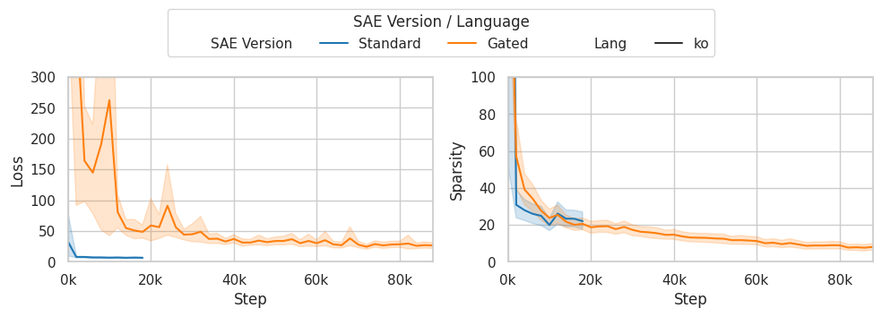
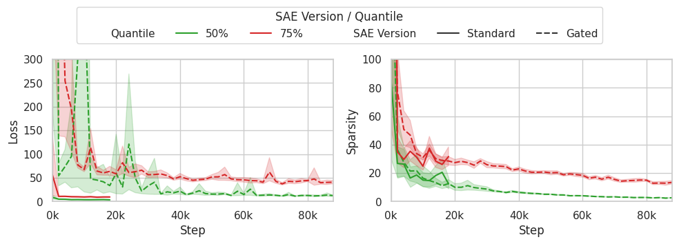

# Korean Sparse LLM Features

## 프로젝트 소개
이 프로젝트는 Sparse Autoencoder를 사용하여 언어 모델(LLM)의 잠재 특징들을 분석하고 시각화하는 도구입니다. TF-IDF(Term Frequency-Inverse Document Frequency) 기반의 시각화 방법을 통해 모델이 학습한 특징들을 직관적으로 이해할 수 있도록 합니다. 특히 한국어 텍스트에 특화된 특징 추출과 분석을 제공합니다.

## 주요 기능
- Sparse Autoencoder를 통한 LLM 특징 추출
  - 대규모 언어 모델의 중간 레이어에서 의미있는 특징 추출
  - 효율적인 차원 축소와 특징 압축
- TF-IDF 기반 특징 중요도 분석
  - 문서 집합에서 특징의 상대적 중요도 계산
  - 핵심 특징 자동 식별
- 추출된 특징들의 다양한 시각화
  - UMAP을 통한 고차원 특징의 2D 시각화
  - 특징 중요도 히트맵
  - 학습 과정 모니터링

## 시각화 결과

### 특징 발견 결과

위 그래프는 Sparse Autoencoder를 통해 발견된 주요 특징들의 분포를 보여줍니다. 각 점은 개별 특징을 나타내며, 군집화된 패턴을 통해 유사한 특징들의 그룹을 확인할 수 있습니다.

### 학습 성능 분석

위 그래프들은 모델의 학습 과정을 보여줍니다:
- 상단 그래프: 언어별 손실 함수와 희소성(sparsity) 변화 추이
- 하단 그래프: 특징 활성화의 분위수 분포 변화

### 문서 임베딩 시각화

UMAP을 사용한 문서 임베딩 시각화:
- 첫 번째 그래프: Gated 구조를 사용한 모델의 상위 10개 특징 기반 시각화
- 두 번째 그래프: Standard 구조의 상위 100개 특징 기반 시각화

### 특징 중요도 분석

특징 활성화 빈도 분석:
- x축: 특징 ID
- y축: 활성화 빈도
- 상위 50개 특징의 상대적 중요도를 보여줌

## 설치 방법