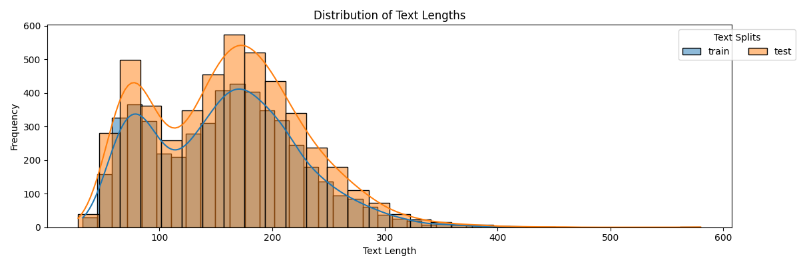

# Keat Small

```bash
git clone https://github.com/emorynlp/MRL-2021
```

## Text Lengths

| Split Name | Min | 25th Percentile | 50th Percentile (Median) | 75th Percentile | Max | Number of Samples |
|------------|-----|-----------------|--------------------------|-----------------|-----|-------------------|
| train | 32 | 101.00 | 160.00 | 200.75 | 424 | 5034 |
| test | 28 | 103.00 | 162.00 | 204.00 | 580 | 4810 |





## Category Distribution (Multiple Labels)


| Label Name | Count |
|------------|--------|
| 국제 | 1485 |
| 문화 | 1442 |
| 정치 | 1415 |
| IT_과학 | 1398 |
| 사회 | 1397 |
| 스포츠 | 1365 |
| 경제 | 1342 |
| 축구 | 610 |
| 인터넷_SNS | 465 |
| 국제일반 | 457 |
| 과학 | 424 |
| 사건_사고 | 410 |
| 청와대 | 397 |
| 해외축구 | 372 |
| 산업_기업 | 372 |
| 북한 | 323 |
| 국회_정당 | 318 |
| 중국 | 310 |
| 교육_시험 | 298 |
| 사회일반 | 279 |
| 국제경제 | 279 |
| 모바일 | 247 |
| 일본 | 233 |
| 출판 | 233 |
| 학술_문화재 | 225 |
| 월드컵 | 221 |
| 요리_여행 | 216 |
| 스포츠일반 | 208 |
| 야구 | 192 |
| 한국프로축구 | 186 |
| 유럽_EU | 183 |
| 노동_복지 | 181 |
| 콘텐츠 | 170 |
| 미국_북미 | 170 |
| 경제일반 | 170 |
| 외교 | 167 |
| 종교 | 160 |
| 방송_연예 | 159 |
| 행정_자치 | 127 |
| 문화일반 | 121 |
| 의료_건강 | 121 |
| 금융_재테크 | 114 |
| 부동산 | 110 |
| 생활 | 98 |
| 한국프로야구 | 89 |
| 메이저리그 | 86 |
| 영화 | 81 |
| 정치일반 | 78 |
| 전시_공연 | 74 |
| 골프 | 71 |
| 여성 | 70 |
| 아시아 | 70 |
| IT_과학일반 | 68 |
| 취업_창업 | 66 |
| 유통 | 57 |
| 미술_건축 | 53 |
| 자동차 | 53 |
| 서비스_쇼핑 | 53 |
| 농구_배구 | 36 |
| 중동_아프리카 | 32 |
| 반도체 | 27 |
| 올림픽_아시안게임 | 27 |
| 보안 | 24 |
| 음악 | 22 |
| 무역 | 19 |
| 장애인 | 18 |
| 중남미 | 18 |
| 러시아 | 12 |
| 국가대표팀 | 11 |
| 외환 | 11 |
| 환경 | 10 |
| 증권_증시 | 6 |
| 자원 | 5 |
| 미디어 | 5 |
| 날씨 | 5 |
| 선거 | 5 |
