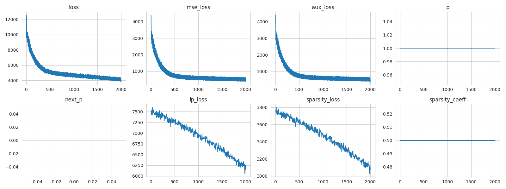

# Gated SAE + Annealing Norm P

This is a gated SAE with an annealing norm p.

```bash
GatedAutoEncoder(
  (encoder): Linear(in_features=512, out_features=32768, bias=False)
  (decoder): Linear(in_features=32768, out_features=512, bias=False)
)
decoder_bias torch.Size([512])
r_mag torch.Size([32768])
gate_bias torch.Size([32768])
mag_bias torch.Size([32768])
encoder.weight torch.Size([32768, 512])
decoder.weight torch.Size([512, 32768])
```


