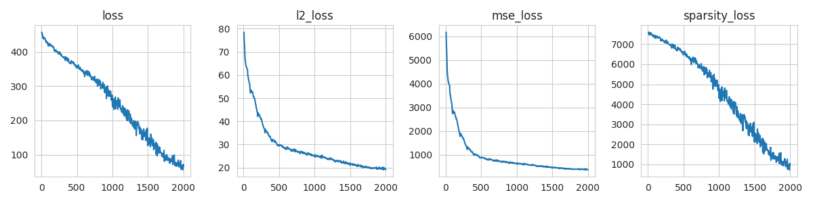

# Standard SAE

Note that 512 * 64 = 32764.

```bash
AutoEncoder(
  (encoder): Linear(in_features=512, out_features=32768, bias=True)
  (decoder): Linear(in_features=32768, out_features=512, bias=False)
)
```


